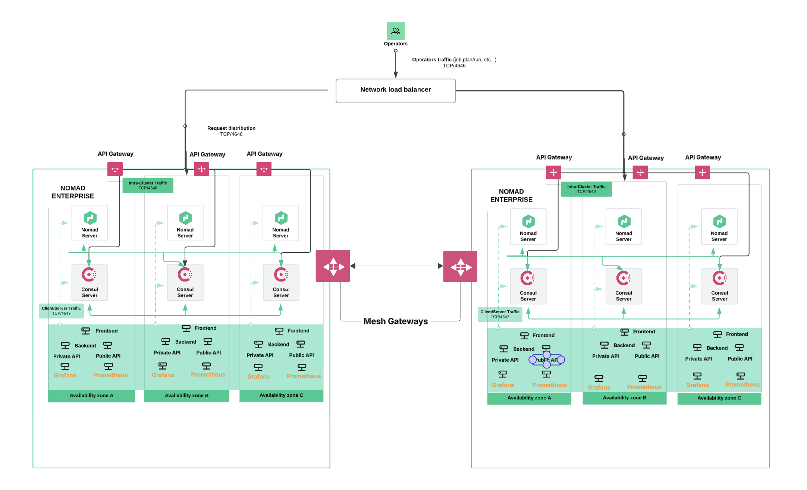

# HashiCorp Enterprise Multi-Cluster Stack on GCP

A production-ready multi-cluster deployment of HashiCorp Consul Enterprise 1.21.0+ent, Nomad Enterprise 1.10.0+ent, and supporting applications on Google Cloud Platform with comprehensive monitoring, load balancing, and enterprise security features.

## 🆕 Latest Updates (January 2025)

**Project Restructured for Multi-Cluster Deployment:**
- ✅ **New GCP Project**: Migrated to `hc-1031dcc8d7c24bfdbb4c08979b0` 
- ✅ **European Regions**: DC1 (europe-southwest1) + DC2 (europe-west1)
- ✅ **Simplified Structure**: `clusters/dc1/` and `clusters/dc2/` folders
- ✅ **Custom Images**: Built with Packer using latest HashiStack versions
- ✅ **HCP Terraform**: Workspace integration with `DB-cluster-1` and `DC-cluster-2`
- ✅ **Task Automation**: Enhanced Taskfile for complete lifecycle management
- ✅ **Load Balancer**: Fixed GCP 5-port limit, added port 8081 for API Gateway
- ✅ **API Gateway**: Consul API Gateway deployment with Nomad integration
- ✅ **Admin Partitions**: Dedicated GKE demo with multi-tenant isolation

## 🎯 Demo Options

This project provides two complete demonstrations:

### 1. **Main Demo**: Nomad + Consul on GCE
- **Path**: `clusters/dc1/` and `clusters/dc2/`  
- **Technology**: Consul + Nomad Enterprise on Google Compute Engine
- **Features**: Multi-cluster deployment, cluster peering, application orchestration

### 2. **Admin Partitions Demo**: Consul on GKE  
- **Path**: `consul/admin-partitions/`
- **Technology**: Consul Enterprise Admin Partitions on Google Kubernetes Engine  
- **Features**: Multi-tenant isolation, cross-partition service mesh, DTAP environments

**→ For Admin Partitions demo, see [`consul/admin-partitions/README.md`](consul/admin-partitions/README.md)**

## 🏗️ Architecture Overview



This project deploys a complete HashiCorp ecosystem with:

- **3 Server Nodes**: Combined Consul/Nomad servers with enterprise licenses (e2-standard-2)
- **2 Client Nodes**: Nomad workers for application workloads (e2-standard-4) 
- **Enterprise Security**: ACLs enabled, TLS encryption, service mesh with Consul Connect
- **Load Balancing**: Traefik v3.0 + GCP HTTP Load Balancer with DNS integration
- **Monitoring Stack**: Prometheus + Grafana with pre-configured dashboards
- **Infrastructure**: Managed instance groups, auto-healing, regional distribution

## 📋 Prerequisites

### Required Accounts & Licenses
- **GCP Project** with the following IAM roles:
  - `roles/owner` or `roles/editor`
  - `roles/iam.serviceAccountUser`
  - `roles/compute.admin`
  - `roles/dns.admin` (if using DNS zones)
- **HashiCorp Consul Enterprise License** (1.21.0+ent compatible)
- **HashiCorp Nomad Enterprise License** (1.10.0+ent compatible)

### Required Tools
- **Terraform CLI** v1.0+ or **HCP Terraform** access
- **HashiCorp Packer** for custom image building
- **gcloud CLI** configured with appropriate credentials

## 🛠️ Quick Start

### Using the Taskfile (Recommended)

This project includes a comprehensive Taskfile for easy management of single or multi-cluster deployments:

```bash
# Show all available tasks and help
task help
task                    # Same as 'task help'

# Show cluster peering instructions  
task peering:help
```

### Basic Deployment Tasks

```bash
# Build HashiStack images first (REQUIRED)
task build-images        # Build custom images with Packer

# Deploy single cluster
task deploy-dc1          # Deploy DC1 (europe-southwest1)
task deploy-dc2          # Deploy DC2 (europe-west1)

# Deploy both clusters
task deploy-both         # Deploy both DC1 and DC2

# Deploy networking (Traefik)
task deploy-networking   # Deploy Traefik to both clusters

# Deploy monitoring (Prometheus + Grafana)
task deploy-monitoring   # Deploy monitoring stack to both clusters

# Full stack deployment
task deploy-full-stack   # Deploy infrastructure + networking + monitoring

# Get environment variables
task eval-vars           # Show environment setup for both clusters
task eval-vars-dc1       # Show DC1 environment variables
task eval-vars-dc2       # Show DC2 environment variables

# Show all access URLs
task show-urls           # Display all service URLs for both clusters

# Cluster status
task status-dc1          # Show DC1 status
task status-dc2          # Show DC2 status
```

### Manual Deployment (Alternative)

#### 1. Build Custom Images
```bash
cd packer/gcp
# Edit gcp/consul_gcp.auth.pkvars.hcl with your GCP project
packer build .
```

#### 2. Configure Variables for Each Cluster
```bash
# For DC1
cd clusters/dc1/terraform
cp terraform.tfvars.example terraform.auto.tfvars

# For DC2
cd clusters/dc2/terraform
cp terraform.tfvars.example terraform.auto.tfvars
```

Required variables for each cluster:
```hcl
# DC1 Configuration
gcp_region = "europe-southwest1"
gcp_project = "your-gcp-project-id" 
gcp_sa = "your-service-account@project.iam.gserviceaccount.com"
cluster_name = "gcp-dc1"
owner = "your-alias"
consul_license = "02MV4UU43BK5HGYY..." # Your Consul Enterprise license
nomad_license = "02MV4UU43BK5HGYY..."  # Your Nomad Enterprise license
dns_zone = "your-dns-zone-name"        # Optional: for FQDN access

# DC2 Configuration (modify region and cluster name)
gcp_region = "europe-west1"
cluster_name = "gcp-dc2"
# Other variables remain the same
```

#### 3. Deploy Infrastructure
```bash
# Deploy DC1
cd clusters/dc1/terraform
terraform init
terraform plan
terraform apply

# Deploy DC2
cd clusters/dc2/terraform
terraform init
terraform plan
terraform apply
```

#### 4. Configure Environment & Setup Consul-Nomad Integration
```bash
# For DC1
cd clusters/dc1/terraform
eval "$(terraform output -json environment_setup | jq -r .bash_export)"

# SSH to DC1 server and configure Consul-Nomad integration
ssh ubuntu@$(terraform output -json server_nodes | jq -r '.hashi_servers."server-1".public_ip')
sudo nomad setup consul -y

# For DC2
cd clusters/dc2/terraform
eval "$(terraform output -json environment_setup | jq -r .bash_export)"

# SSH to DC2 server and configure Consul-Nomad integration
ssh ubuntu@$(terraform output -json server_nodes | jq -r '.hashi_servers."server-1".public_ip')
sudo nomad setup consul -y
```

**⚠️ CRITICAL:** After infrastructure deployment, you MUST run `nomad setup consul -y` on each cluster's server nodes to establish proper Consul-Nomad integration. This is required for service discovery and Connect mesh functionality.

## 🌐 Multi-Cluster Access Points

### DC1 (europe-southwest1) Access Points

#### Via Load Balancer (with DNS)
- **Consul UI**: `http://consul-gcp-dc1.hc-1031dcc8d7c24bfdbb4c08979b0.gcp.sbx.hashicorpdemo.com:8500`
- **Nomad UI**: `http://nomad-gcp-dc1.hc-1031dcc8d7c24bfdbb4c08979b0.gcp.sbx.hashicorpdemo.com:4646`
- **Grafana**: `http://grafana-gcp-dc1.hc-1031dcc8d7c24bfdbb4c08979b0.gcp.sbx.hashicorpdemo.com:3000` (admin/admin)
- **Traefik Dashboard**: `http://traefik-gcp-dc1.hc-1031dcc8d7c24bfdbb4c08979b0.gcp.sbx.hashicorpdemo.com:8080`
- **Prometheus**: `http://prometheus-gcp-dc1.hc-1031dcc8d7c24bfdbb4c08979b0.gcp.sbx.hashicorpdemo.com:9090`
- **API Gateway**: `http://<clients_lb_ip>:8081` (Routes to front-service)

#### Direct Instance Access
```bash
# Using Taskfile
task ssh-dc1-server       # SSH to DC1 server node

# Manual access
cd clusters/dc1/terraform
terraform output quick_commands
ssh ubuntu@$(terraform output -json server_nodes | jq -r '.hashi_servers."server-1".public_ip')
```

### DC2 (europe-west1) Access Points

#### Access Points
- **Consul UI**: `http://consul-gcp-dc2.hc-1031dcc8d7c24bfdbb4c08979b0.gcp.sbx.hashicorpdemo.com:8500`
- **Nomad UI**: `http://nomad-gcp-dc2.hc-1031dcc8d7c24bfdbb4c08979b0.gcp.sbx.hashicorpdemo.com:4646`
- **Traefik Dashboard**: `http://traefik-gcp-dc2.hc-1031dcc8d7c24bfdbb4c08979b0.gcp.sbx.hashicorpdemo.com:8080`

#### Direct IP Access (Monitoring Services)
Get the clients LB IP: `terraform output load_balancers`
- **Grafana**: `http://<clients_lb_ip>:3000` (admin/admin)
- **Prometheus**: `http://<clients_lb_ip>:9090`
- **API Gateway**: `http://<clients_lb_ip>:8081` (Routes to front-service)

#### Direct Instance Access
```bash
# Using Taskfile
task ssh-dc2-server       # SSH to DC2 server node

# Manual access
cd clusters/dc2/terraform
terraform output quick_commands
ssh ubuntu@$(terraform output -json server_nodes | jq -r '.hashi_servers."server-1".public_ip')
```

### Quick Access Commands
```bash
# Show all URLs for both clusters
task show-urls

# Get environment variables for both clusters
task eval-vars

# Check status of both clusters
task status-dc1
task status-dc2
```

## 🚀 Multi-Cluster Application Deployment

### Using Taskfile (Recommended)
```bash
# Setup Consul-Nomad integration (REQUIRED after infrastructure deployment)
task setup-consul-nomad-both    # Setup integration for both clusters
task setup-consul-nomad-dc1     # Setup integration for DC1 only
task setup-consul-nomad-dc2     # Setup integration for DC2 only

# Deploy networking (Traefik) to both clusters
task deploy-traefik

# Deploy monitoring stack to both clusters
task deploy-monitoring

# Deploy to specific cluster
task deploy-traefik-dc1    # Deploy Traefik to DC1 only
task deploy-traefik-dc2    # Deploy Traefik to DC2 only
task deploy-monitoring-dc1 # Deploy monitoring to DC1 only
task deploy-monitoring-dc2 # Deploy monitoring to DC2 only

# Stop all jobs in a cluster
task stop-jobs-dc1
task stop-jobs-dc2

# Complete deployment workflow
task deploy-full-stack     # Deploy infrastructure + setup integration + networking + monitoring
```

### Manual Deployment

#### Deploy to DC1 (europe-southwest1)
```bash
cd clusters/dc1
# Get environment variables
eval "$(cd terraform && terraform output -json environment_setup | jq -r .bash_export)"

# Deploy applications
nomad job run jobs/monitoring/traefik.hcl
nomad job run jobs/monitoring/prometheus.hcl  
nomad job run jobs/monitoring/grafana.hcl
```

#### Deploy to DC2 (europe-west1)
```bash
cd clusters/dc2
# Get environment variables
eval "$(cd terraform && terraform output -json environment_setup | jq -r .bash_export)"

# Deploy applications
nomad job run jobs/monitoring/traefik.hcl
nomad job run jobs/monitoring/prometheus.hcl  
nomad job run jobs/monitoring/grafana.hcl
```

### Demo Applications
```bash
# Deploy demo apps to both clusters
nomad job run jobs/terramino.nomad.hcl
nomad job status

# Deploy API Gateway and demo services
nomad job run nomad-apps/api-gw.nomad/api-gw.nomad.hcl
nomad job run nomad-apps/demo-fake-service/backend.nomad.hcl
nomad job run nomad-apps/demo-fake-service/frontend.nomad.hcl

# Configure Consul API Gateway
consul config write consul/peering/configs/api-gateway/listener.hcl
consul config write consul/peering/configs/api-gateway/httproute.hcl
```

## 🔗 Consul Cluster Peering

Once both clusters are deployed and running, you can configure cluster peering to enable cross-datacenter service mesh connectivity, load balancing, and failover capabilities.

### Quick Peering Setup

```bash
# 1. Get environment setup instructions
task peering:env-setup

# 2. Set environment variables for both clusters (copy/paste from above)
export DC1_CONSUL_ADDR=http://[DC1_IP]:8500
export DC1_NOMAD_ADDR=http://[DC1_IP]:4646
# ... etc (see output from peering:env-setup)

# 3. Start peering setup (phases 1-8)
task peering:setup

# 4. Establish peering connection
task peering:establish

# 5. Complete peering configuration (phases 9-13)
task peering:complete

# 6. Verify peering works
task peering:verify
```

### Advanced Peering Features

```bash
# Configure failover with sameness groups (recommended)
task peering:sameness-groups

# Or configure service resolver for failover
task peering:service-resolver

# Check peering status
task status                    # Shows peering status if env vars set

# Clean up peering
task peering:cleanup
```

### What Cluster Peering Provides

- **Cross-Datacenter Service Discovery**: Services in DC1 can discover and connect to services in DC2
- **Service Mesh Connectivity**: Secure, encrypted communication between services across clusters
- **Load Balancing**: Distribute traffic across multiple datacenters
- **Failover**: Automatic failover to secondary datacenter when primary is unavailable
- **API Gateway**: Single entry point routing traffic to services across both clusters

### Detailed Setup Guide

For detailed step-by-step instructions, including all configuration phases, troubleshooting, and advanced scenarios:

📖 **[Consul Peering Setup Guide](consul/peering/README.md)**

## 🔧 Key Features

### Enterprise Security
- **ACL System**: Bootstrap tokens, fine-grained permissions
- **TLS Encryption**: All HashiCorp services encrypted in transit
- **Service Mesh**: Consul Connect for zero-trust networking
- **Firewall Rules**: Restricted access, internal communication secured

### High Availability
- **Instance Groups**: Auto-healing, rolling updates, zone distribution
- **Load Balancers**: Multi-tier (GCP Global + Traefik)
- **Health Checks**: Application and infrastructure monitoring
- **Backup Strategy**: Persistent disks, stateful configurations

### Monitoring & Observability
- **Prometheus**: Metrics collection from all HashiCorp services
- **Grafana**: Pre-configured dashboards for Consul, Nomad, and infrastructure
- **Traefik**: Request routing, load balancing, and traffic metrics
- **Logging**: Centralized via systemd journal

## 📊 Terraform Outputs

The deployment provides comprehensive outputs:

```bash
# View all outputs
terraform output

# Specific information
terraform output cluster_info          # Basic cluster details
terraform output hashistack_urls      # Consul/Nomad access URLs  
terraform output monitoring_urls      # Grafana/Prometheus URLs
terraform output server_nodes         # Server instance group info
terraform output client_nodes         # Client instance groups info
terraform output auth_tokens          # Enterprise tokens (sensitive)
terraform output quick_commands       # Useful management commands
terraform output load_balancers       # Load balancer IP addresses
```

### Load Balancer Access Points

Each cluster provides two load balancer IPs for different services:

```bash
# Get load balancer IPs
terraform output load_balancers

# Direct IP access (when DNS is not configured)
# Global LB (HashiCorp Stack)
http://<global_lb_ip>:8500    # Consul UI
http://<global_lb_ip>:4646    # Nomad UI

# Clients LB (Applications & Monitoring)
http://<clients_lb_ip>:3000   # Grafana (admin/admin)
http://<clients_lb_ip>:8080   # Traefik Dashboard
http://<clients_lb_ip>:8081   # API Gateway
http://<clients_lb_ip>:9090   # Prometheus
```

### Port Configuration

The load balancer exposes the following ports (limited to 5 by GCP):
- **Port 80**: HTTP traffic
- **Port 3000**: Grafana dashboard
- **Port 8080**: Traefik dashboard
- **Port 8081**: Consul API Gateway (NEW)
- **Port 9090**: Prometheus metrics

*Note: HTTPS (port 443) removed to stay within GCP's 5-port limit for demo purposes.*

## 🔐 Security Considerations

- **Enterprise Licenses**: Stored as sensitive Terraform variables
- **Bootstrap Tokens**: Auto-generated, marked sensitive in outputs
- **TLS Certificates**: Self-signed CA, server certificates auto-generated
- **Network Security**: VPC isolation, firewall rules, internal communication only
- **Access Control**: ACLs enabled by default, least-privilege principles

## 🛠️ Multi-Cluster Operations

### Taskfile Management
```bash
# Infrastructure management
task deploy-both          # Deploy both clusters
task destroy-both         # Destroy both clusters
task deploy-full-stack    # Deploy complete stack with networking and monitoring

# Application management
task deploy-networking    # Deploy Traefik to both clusters
task deploy-monitoring    # Deploy Prometheus + Grafana to both clusters
task stop-jobs-dc1       # Stop all jobs in DC1
task stop-jobs-dc2       # Stop all jobs in DC2

# Status and monitoring
task show-urls           # Show all service URLs
task eval-vars           # Show environment variables for both clusters
task status-dc1          # Show DC1 cluster status
task status-dc2          # Show DC2 cluster status
```

### Cluster Management
```bash
# Check cluster health (DC1)
task eval-vars-dc1 && eval "$(task eval-vars-dc1 --silent)"
consul members
nomad server members
nomad node status

# Check cluster health (DC2)
task eval-vars-dc2 && eval "$(task eval-vars-dc2 --silent)"
consul members
nomad server members
nomad node status

# View job status
nomad job status
nomad alloc status <allocation-id>

# Scale applications
nomad job scale <job-name> <count>
```

### Troubleshooting
```bash
# Check service status on nodes (SSH required)
task ssh-dc1-server  # SSH to DC1 server
task ssh-dc2-server  # SSH to DC2 server

# On server nodes:
sudo systemctl status consul
sudo systemctl status nomad
sudo journalctl -u consul -f
sudo journalctl -u nomad -f

# View application logs
nomad alloc logs <allocation-id>
nomad alloc logs -f <allocation-id>
```

### Infrastructure Updates
```bash
# Update specific cluster
cd clusters/dc1/terraform
terraform plan
terraform apply

# Update both clusters
task deploy-both

# Rolling update (managed instance groups handle this automatically)
# Check status in GCP Console > Compute Engine > Instance Groups
```

## 🔄 Migration and Current State

This project has been recently migrated and updated with:

### Current Configuration (January 2025)
- **GCP Project**: `hc-1031dcc8d7c24bfdbb4c08979b0`
- **Service Account**: `hc-1031dcc8d7c24bfdbb4c08979b0@appspot.gserviceaccount.com`
- **DNS Zone**: `doormat-accountid`
- **DNS Domain**: `hc-1031dcc8d7c24bfdbb4c08979b0.gcp.sbx.hashicorpdemo.com`
- **DC1 Region**: `europe-southwest1` (zones: a, b)
- **DC2 Region**: `europe-west1` (zones: b, c)

### HCP Terraform Workspaces
- **DC1**: `pablogd-hcp-test/DB-cluster-1`
- **DC2**: `pablogd-hcp-test/DC-cluster-2`

### Built Images
Custom HashiStack images built with Packer containing:
- **Consul Enterprise**: 1.21.0+ent
- **Nomad Enterprise**: 1.10.0+ent
- **Vault**: 1.14.1
- **Docker**: Latest
- **TLS Configuration**: Pre-configured certificates

### Deployment Status
✅ **Packer Images**: Built successfully in new project  
🔄 **DC1 Infrastructure**: Currently deploying  
⏳ **DC2 Infrastructure**: Pending DC1 completion  
⏳ **Consul-Nomad Integration**: Required after infrastructure  
⏳ **Application Deployment**: Traefik + Monitoring stack  

## 📁 Multi-Cluster Project Structure

```
├── Taskfile.yml                      # Task automation for multi-cluster management
├── docs/                              # Documentation and assets
│   └── images/                        # Architecture diagrams and images
├── clusters/
│   ├── dc1/                        # DC1 cluster (europe-southwest1)
│   │   ├── terraform/              # DC1 infrastructure
│   │   │   ├── main.tf             # Core networking, load balancers, DNS
│   │   │   ├── instances.tf        # Instance groups, templates, configs
│   │   │   ├── variables.tf        # Input variables
│   │   │   ├── outputs.tf          # Structured outputs
│   │   │   └── consul.tf           # Consul-specific resources
│   │   └── jobs/                   # DC1 Nomad job definitions
│   │       └── monitoring/         # Monitoring stack jobs
│   │           ├── traefik.hcl     # Load balancer
│   │           ├── prometheus.hcl  # Metrics collection
│   │           └── grafana.hcl     # Monitoring dashboard
│   └── dc2/                        # DC2 cluster (europe-west1)
│       ├── terraform/              # DC2 infrastructure (identical to DC1)
│       └── jobs/                   # DC2 Nomad job definitions (identical to DC1)
├── packer/                         # Custom image builds
│   └── gcp/                       # GCP-specific Packer configs
├── nomad-apps/                   # Application definitions
│   ├── api-gw.nomad/             # Consul API Gateway
│   │   └── api-gw.nomad.hcl      # API Gateway Nomad job
│   ├── demo-fake-service/        # Demo microservices
│   │   ├── backend.nomad.hcl     # Backend API services
│   │   └── frontend.nomad.hcl    # Frontend service
│   ├── monitoring/               # Monitoring stack
│   │   ├── traefik.hcl          # Load balancer
│   │   ├── prometheus.hcl       # Metrics collection
│   │   └── grafana.hcl          # Monitoring dashboard
│   └── terramino.hcl            # Demo Tetris game
├── consul/                       # Consul configurations
│   └── peering/                  # Consul Connect and API Gateway configs
│       └── configs/
│           └── api-gateway/
│               ├── listener.hcl  # API Gateway listener (port 8081)
│               └── httproute.hcl # HTTP routing rules
└── scripts/                      # Deployment automation
```

### Key Architecture Notes

- **Identical Configurations**: DC1 and DC2 have identical Terraform configurations and Nomad jobs
- **Regional Separation**: DC1 deploys to europe-southwest1, DC2 deploys to europe-west1
- **Centralized Management**: Taskfile provides unified commands for both clusters
- **Independent Operation**: Each cluster operates independently with its own resources
- **Consistent Naming**: Resources are named with cluster-specific prefixes (gcp-dc1, gcp-dc2)
- **HCP Terraform Integration**: Uses workspaces `DB-cluster-1` and `DC-cluster-2`
- **Custom Images**: Built with Packer containing Consul Enterprise 1.21.0+ent and Nomad Enterprise 1.10.0+ent

## 🤝 Contributing

This is a demonstration repository. For production use:

1. Review and adapt security configurations
2. Implement proper backup strategies  
3. Configure monitoring alerts
4. Establish CI/CD pipelines
5. Review network security policies

## 📝 License

This project is for demonstration purposes. Ensure you have proper HashiCorp Enterprise licenses before deploying.

---

**Note**: This deployment creates billable GCP resources. Remember to run `terraform destroy` when done testing.